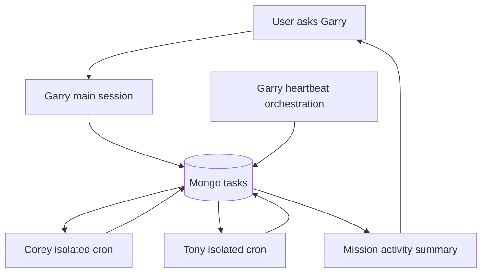

# Mission Control MVP Plan (Mongo + 3 Agents, 10-Agent Ready)

## Target Outcome

- Garry, Corey, and Tony can coordinate via a shared MongoDB task system instead of ad-hoc direct handoffs.
- Agents poll for assigned work on cron, execute tasks, and write status/log/output back to Mongo.
- Data model, naming, and orchestration are designed so adding more agents later is mostly agent config + cron additions.

## Architecture Shape

- **Control plane:** OpenClaw gateway + cron + heartbeat (existing runtime).
- **Coordination store:** MongoDB `mission_control` database (single source of truth).
- **Agent interface:** `mongo-mission-control` skill exposing task CRUD + dependency-ready operations.
- **Execution model:** Isolated cron jobs for Corey/Tony; Garry heartbeat handles dependency release and review routing.

## Phase 1: Baseline and Contracts

- Lock the canonical task schema from `[/Users/michaelhoughton/Documents/openclaw-experiment/openclaw-vps/.openclaw/workspace/MISSION_CONTROL_PROPOSAL.md](/Users/michaelhoughton/Documents/openclaw-experiment/openclaw-vps/.openclaw/workspace/MISSION_CONTROL_PROPOSAL.md)` and add explicit enum lists for `status`, `priority`, `trigger_state`.
- Add an `agents` collection (or static config file) mapping OpenClaw `agentId/sessionKey` to assignee slug (`garry/corey/tony/...`) so scaling to 10 is data-driven.
- Define strict task transition rules (`todo -> in_progress -> review -> done`, blocked path allowed) to avoid inconsistent agent updates.

## Phase 2: Mongo Skill Layer

- Create a new skill package `mongo-mission-control` in the OpenClaw skills path used by your VPS config.
- Implement minimum actions:
  - `task_create`
  - `task_poll_ready_for_assignee`
  - `task_claim`
  - `task_append_log`
  - `task_complete_with_output`
  - `task_mark_blocked`
  - `task_release_dependencies`
- Add idempotency guards (claim only if `status=todo` and `trigger_state=READY`) to prevent duplicate work across overlapping cron runs.

## Phase 3: Agent Operating Protocols

- Add short, explicit mission-control runbooks in:
  - `[/Users/michaelhoughton/Documents/openclaw-experiment/openclaw-vps/.openclaw/workspace/HEARTBEAT.md](/Users/michaelhoughton/Documents/openclaw-experiment/openclaw-vps/.openclaw/workspace/HEARTBEAT.md)` for Garry orchestration
  - `[/Users/michaelhoughton/Documents/openclaw-experiment/openclaw-vps/.openclaw/workspace-corey/HEARTBEAT.md](/Users/michaelhoughton/Documents/openclaw-experiment/openclaw-vps/.openclaw/workspace-corey/HEARTBEAT.md)`
  - `[/Users/michaelhoughton/Documents/openclaw-experiment/openclaw-vps/.openclaw/workspace-tony/HEARTBEAT.md](/Users/michaelhoughton/Documents/openclaw-experiment/openclaw-vps/.openclaw/workspace-tony/HEARTBEAT.md)`
- Keep prompts deterministic: poll -> claim -> execute -> update -> exit (or `HEARTBEAT_OK` if no work).

## Phase 4: Cron Orchestration

- Add isolated cron jobs for Corey and Tony in `[/Users/michaelhoughton/Documents/openclaw-experiment/openclaw-vps/.openclaw/cron/jobs.json](/Users/michaelhoughton/Documents/openclaw-experiment/openclaw-vps/.openclaw/cron/jobs.json)` with staggered schedule.
- Add a Garry orchestration cron/heartbeat check to release dependent tasks (`WAITING -> READY`) when all dependencies are done.
- Start with moderate cadence (e.g. every 15 min staggered) and tune based on cost + latency.

## Phase 5: Visibility and Control

- Add a minimal mission-control CLI/report script in workspace scripts to print:
  - ready tasks per assignee
  - blocked tasks + blocker reason
  - tasks in review awaiting Michael
- Add optional daily standup summary generated from Mongo aggregates and posted through Garry.

## Phase 6: Reliability and Rollout

- Add `.env`/secret loading for Mongo URI on VPS (no credential commits).
- Dry-run locally against sample tasks, then deploy via the existing VPS sync flow from `[/Users/michaelhoughton/Documents/openclaw-experiment/.cursor/skills/openclaw-vps-sync/SKILL.md](/Users/michaelhoughton/Documents/openclaw-experiment/.cursor/skills/openclaw-vps-sync/SKILL.md)`.
- Validate success criteria:
  - Corey/Tony independently pick up assigned READY tasks.
  - Garry correctly releases dependent tasks.
  - No duplicate claims under concurrent cron triggers.
  - Task history is auditable through logs/output fields.

## Definition of Done (MVP)

- 3-agent mission loop is operational in VPS.
- Mongo-backed task lifecycle is stable for at least 3 full task cycles (including one dependency chain).
- Add-agent procedure documented so agents 4-10 can be onboarded by config + cron only.

