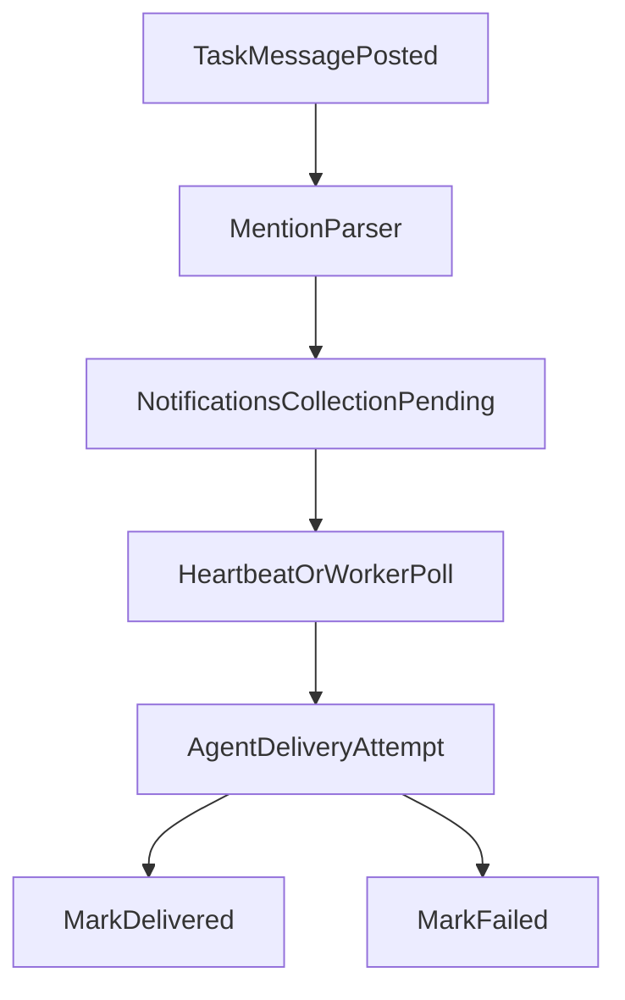

# Mission Control Phase 1 Plan (Mongo-First)

## Outcome

Add first-class message threads and mention-driven notifications to the existing Mission Control stack without migrating away from Mongo or replacing polling transport.

## Scope and Boundaries

- In scope:
  - Task message thread model and APIs
  - Mention parsing (`@assignee`, `@all`) and notification queue creation
  - Notification poll/ack flow for workers and operators
  - Minimal UI thread surface in task detail
  - VPS CLI + heartbeat integration for notification checks
- Out of scope (explicitly deferred):
  - Convex migration
  - WebSocket/SSE push transport
  - Full 10-agent activation changes

## Implementation Plan

### 1) Add Message + Notification Data Contracts

- Update mission types/constants/schemas in:
  - `[/Users/michaelhoughton/Documents/openclaw-experiment/openclaw-brain/mission-control-ui/lib/mission/types.ts](/Users/michaelhoughton/Documents/openclaw-experiment/openclaw-brain/mission-control-ui/lib/mission/types.ts)`
  - `[/Users/michaelhoughton/Documents/openclaw-experiment/openclaw-brain/mission-control-ui/lib/mission/constants.ts](/Users/michaelhoughton/Documents/openclaw-experiment/openclaw-brain/mission-control-ui/lib/mission/constants.ts)`
  - `[/Users/michaelhoughton/Documents/openclaw-experiment/openclaw-brain/mission-control-ui/lib/mission/schemas.ts](/Users/michaelhoughton/Documents/openclaw-experiment/openclaw-brain/mission-control-ui/lib/mission/schemas.ts)`
- Introduce:
  - `TaskMessage` / `TaskMessageDocument`
  - `Notification` / `NotificationDocument`
  - Mention extraction rules and notification statuses (`pending`, `delivered`, `failed`)

### 2) Add Mongo Collections + Indexes

- Extend DB wiring and indexes in:
  - `[/Users/michaelhoughton/Documents/openclaw-experiment/openclaw-brain/mission-control-ui/lib/mongodb.ts](/Users/michaelhoughton/Documents/openclaw-experiment/openclaw-brain/mission-control-ui/lib/mongodb.ts)`
- Add indexes for:
  - `messages` by `taskId`, `created_at`
  - `notifications` by `mentionedAssignee`, `status`, `created_at`, plus optional dedupe key

### 3) Repository-Level Behavior

- Implement repository functions in:
  - `[/Users/michaelhoughton/Documents/openclaw-experiment/openclaw-brain/mission-control-ui/lib/mission/repository.ts](/Users/michaelhoughton/Documents/openclaw-experiment/openclaw-brain/mission-control-ui/lib/mission/repository.ts)`
- Functions to add:
  - `createTaskMessage()`
  - `listTaskMessages()`
  - `listNotifications()`
  - `ackNotificationDelivery()`
- Core behavior:
  - Parse mentions from message content
  - Resolve recipients from known assignees + `@all`
  - Enqueue one notification per recipient (excluding sender)
  - Emit activity events (`message_created`, `notification_enqueued`, `notification_delivered`)

### 4) API Routes and Security

- Add routes:
  - `[/Users/michaelhoughton/Documents/openclaw-experiment/openclaw-brain/mission-control-ui/app/api/tasks/[id]/messages/route.ts](/Users/michaelhoughton/Documents/openclaw-experiment/openclaw-brain/mission-control-ui/app/api/tasks/[id]/messages/route.ts)`
  - `[/Users/michaelhoughton/Documents/openclaw-experiment/openclaw-brain/mission-control-ui/app/api/notifications/route.ts](/Users/michaelhoughton/Documents/openclaw-experiment/openclaw-brain/mission-control-ui/app/api/notifications/route.ts)`
  - `[/Users/michaelhoughton/Documents/openclaw-experiment/openclaw-brain/mission-control-ui/app/api/notifications/[id]/deliver/route.ts](/Users/michaelhoughton/Documents/openclaw-experiment/openclaw-brain/mission-control-ui/app/api/notifications/[id]/deliver/route.ts)`
- Reuse existing security gates from:
  - `[/Users/michaelhoughton/Documents/openclaw-experiment/openclaw-brain/mission-control-ui/lib/security.ts](/Users/michaelhoughton/Documents/openclaw-experiment/openclaw-brain/mission-control-ui/lib/security.ts)`
  - mutation secret and mutation rate limiting for write endpoints

### 5) UI Thread Surface (Task Detail)

- Extend client and task detail UI:
  - `[/Users/michaelhoughton/Documents/openclaw-experiment/openclaw-brain/mission-control-ui/lib/mission/client.ts](/Users/michaelhoughton/Documents/openclaw-experiment/openclaw-brain/mission-control-ui/lib/mission/client.ts)`
  - `[/Users/michaelhoughton/Documents/openclaw-experiment/openclaw-brain/mission-control-ui/components/mission/task-detail-sheet.tsx](/Users/michaelhoughton/Documents/openclaw-experiment/openclaw-brain/mission-control-ui/components/mission/task-detail-sheet.tsx)`
  - New: `[/Users/michaelhoughton/Documents/openclaw-experiment/openclaw-brain/mission-control-ui/components/mission/task-message-thread.tsx](/Users/michaelhoughton/Documents/openclaw-experiment/openclaw-brain/mission-control-ui/components/mission/task-message-thread.tsx)`
- Add:
  - Read message thread for selected task
  - Post message with mentions
  - Keep existing `agent_logs` visible for audit continuity

### 6) VPS Worker Integration (Polling Delivery)

- Extend CLI actions in:
  - `[/Users/michaelhoughton/Documents/openclaw-experiment/openclaw-vps/.openclaw/workspace/scripts/mission-control-cli.mjs](/Users/michaelhoughton/Documents/openclaw-experiment/openclaw-vps/.openclaw/workspace/scripts/mission-control-cli.mjs)`
- Add actions:
  - `notification_poll_for_assignee`
  - `notification_mark_delivered`
  - `notification_mark_failed`
- Update heartbeat playbooks so workers check notifications before task polling:
  - `[/Users/michaelhoughton/Documents/openclaw-experiment/openclaw-vps/.openclaw/workspace/HEARTBEAT.md](/Users/michaelhoughton/Documents/openclaw-experiment/openclaw-vps/.openclaw/workspace/HEARTBEAT.md)`
  - `[/Users/michaelhoughton/Documents/openclaw-experiment/openclaw-vps/.openclaw/workspace-corey/HEARTBEAT.md](/Users/michaelhoughton/Documents/openclaw-experiment/openclaw-vps/.openclaw/workspace-corey/HEARTBEAT.md)`
  - `[/Users/michaelhoughton/Documents/openclaw-experiment/openclaw-vps/.openclaw/workspace-tony/HEARTBEAT.md](/Users/michaelhoughton/Documents/openclaw-experiment/openclaw-vps/.openclaw/workspace-tony/HEARTBEAT.md)`

## Delivery Flow (Phase 1)

## Validation Plan

- API-level checks:
  - Create message with `@corey` and verify notification row exists
  - Create message with `@all` and verify fan-out notifications
  - Mark delivered/failed and verify status transitions + activity events
- UI checks:
  - Thread loads in task detail
  - Posting message appends thread and triggers notification count changes
- VPS flow checks:
  - `mission-control-cli` poll/ack commands run cleanly
  - Heartbeat docs execute notification-first loop without breaking existing claim logic

## Docs and Operational Notes

- Update API/usage docs in:
  - `[/Users/michaelhoughton/Documents/openclaw-experiment/openclaw-brain/mission-control-ui/README.md](/Users/michaelhoughton/Documents/openclaw-experiment/openclaw-brain/mission-control-ui/README.md)`
  - `[/Users/michaelhoughton/Documents/openclaw-experiment/openclaw-vps/.openclaw/workspace/scripts/README.md](/Users/michaelhoughton/Documents/openclaw-experiment/openclaw-vps/.openclaw/workspace/scripts/README.md)`
- Keep this phase backward-compatible by preserving current task/audit log paths while introducing message/notification capabilities.

