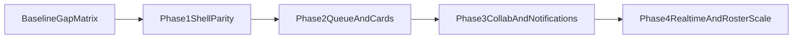

# Mission Control UI Analysis + Gap Closure Plan

## Objective

Compare the reference Mission Control screenshot with the current implementation and deliver a prioritized set of additions that close the biggest functional deficits while improving usability for multi-agent operations, while preserving OpenClaw's existing design language.

## Design Direction (frontend-design aligned)

- Keep the current Mission Control brand vibe and visual identity as the baseline.
- Borrow from the screenshot primarily at the **interaction and information architecture** level (layout zones, filters, feed structure, board controls), not as direct visual mimicry.
- Apply `frontend-design` quality bars to each phase:
  - stronger typography hierarchy and display/body pairing
  - cohesive token-driven color system with purposeful accents
  - intentional motion for high-value transitions (not noisy animation)
  - distinctive spatial composition and panel rhythm
  - atmospheric details (depth/texture/surfaces) that remain performant and readable
- Avoid generic dashboard aesthetics; target a deliberate editorial-operations feel unique to OpenClaw.

## What Exists Today (Ground Truth)

- Current dashboard is a single-card layout with sections for health, kanban, review queue, docs, and activity feed in one vertical flow: `[openclaw-brain/mission-control-ui/components/mission/dashboard.tsx](openclaw-brain/mission-control-ui/components/mission/dashboard.tsx)`.
- Kanban supports status grouping and task selection but no drag/drop and minimal card metadata: `[openclaw-brain/mission-control-ui/components/mission/kanban-board.tsx](openclaw-brain/mission-control-ui/components/mission/kanban-board.tsx)`.
- Activity feed is a simple, unfiltered list: `[openclaw-brain/mission-control-ui/components/mission/activity-feed.tsx](openclaw-brain/mission-control-ui/components/mission/activity-feed.tsx)`.
- Task thread supports `@mentions` and backend queueing of notifications exists, but there is no operator-facing notification panel: `[openclaw-brain/mission-control-ui/components/mission/task-message-thread.tsx](openclaw-brain/mission-control-ui/components/mission/task-message-thread.tsx)`, `[openclaw-brain/mission-control-ui/lib/mission/repository.ts](openclaw-brain/mission-control-ui/lib/mission/repository.ts)`.
- Agent health and several data queries are constrained to active default assignees (`garry/corey/tony`): `[openclaw-brain/mission-control-ui/lib/mission/constants.ts](openclaw-brain/mission-control-ui/lib/mission/constants.ts)`, `[openclaw-brain/mission-control-ui/lib/mission/repository.ts](openclaw-brain/mission-control-ui/lib/mission/repository.ts)`.

## Reference Screenshot Capabilities (Target Behaviors)

- Multi-pane command center shell: top system bar, left agent directory, center queue board, right live feed.
- Board-level status tabs and counts (Inbox/Assigned/Blocked/Done etc.) + rich card metadata (priority chips, tags, owner, age, comment counts).
- Live feed with type filters (tasks/comments/decisions) and actor filters.
- Always-visible agent roster and quick “all agents vs specific agents” filtering.
- Strong real-time feel (near-instant updates across queue/feed).

## Gap Analysis (Current vs Target)

- **Layout deficit:** no persistent left rail/top command bar/right live stream composition.
- **Workflow deficit:** no board tab strip, no quick segmentation views, no drag/drop movement.
- **Collaboration deficit:** notifications exist in backend but no visible notification/inbox surface.
- **Feed deficit:** no feed facets (event type, agent, scope) and limited operator triage controls.
- **Scale deficit:** health/filter defaults still optimized for 3-agent operation instead of full roster.
- **Realtime deficit:** polling-only refresh model (`7s`) weakens “Mission Control HQ” immediacy.

## Proposed Additions (Prioritized)

### Phase 1 — Structural UI Parity (Highest impact)

- Implement a new shell component with 4 zones:
  - top command/status bar
  - left `AgentsRail`
  - center `MissionQueueBoard`
  - right `LiveFeedPanel`
- Keep existing task/detail/doc sheets and wire them into the new shell to avoid rewriting validated workflows.
- Introduce visual shell primitives (surface tiers, spacing rhythm, typography scale) that match current brand vibe before adding new interaction density.
- Primary files:
  - `[openclaw-brain/mission-control-ui/components/mission/dashboard.tsx](openclaw-brain/mission-control-ui/components/mission/dashboard.tsx)`
  - `[openclaw-brain/mission-control-ui/app/globals.css](openclaw-brain/mission-control-ui/app/globals.css)`
  - new: `components/mission/top-command-bar.tsx`
  - new: `components/mission/agents-rail.tsx`
  - new: `components/mission/live-feed-panel.tsx`

### Phase 2 — Queue + Card Interaction Parity

- Add status tab strip with counts and quick filters (`all`, per-status, `assigned-to-me`, `blocked`).
- Enrich task cards with tags, relative time, and comment/document counters.
- Add optional drag/drop transitions for allowed status changes.
- Add card hierarchy and affordances with intentional micro-motion to improve scanability without breaking current tone.
- Primary files:
  - `[openclaw-brain/mission-control-ui/components/mission/kanban-board.tsx](openclaw-brain/mission-control-ui/components/mission/kanban-board.tsx)`
  - `[openclaw-brain/mission-control-ui/components/mission/status-badge.tsx](openclaw-brain/mission-control-ui/components/mission/status-badge.tsx)`
  - `[openclaw-brain/mission-control-ui/lib/mission/types.ts](openclaw-brain/mission-control-ui/lib/mission/types.ts)`

### Phase 3 — Collaboration + Notification Surfaces

- Add a visible notifications drawer/panel (pending/delivered/failed) with task deep-links.
- Add feed facet filters (type + assignee) and persisted UI filter state.
- Link message thread actions directly to feed highlights for quick context hopping.
- Ensure right-rail/live-feed styling stays consistent with OpenClaw's style system instead of screenshot-style copy.
- Primary files:
  - `[openclaw-brain/mission-control-ui/components/mission/activity-feed.tsx](openclaw-brain/mission-control-ui/components/mission/activity-feed.tsx)`
  - `[openclaw-brain/mission-control-ui/app/api/notifications/route.ts](openclaw-brain/mission-control-ui/app/api/notifications/route.ts)`
  - `[openclaw-brain/mission-control-ui/lib/mission/client.ts](openclaw-brain/mission-control-ui/lib/mission/client.ts)`
  - new: `components/mission/notifications-panel.tsx`

### Phase 4 — Full-Roster + Realtime Upgrades

- Expand roster-aware queries and defaults beyond `ACTIVE_DEFAULT_ASSIGNEES` where appropriate.
- Replace or complement 7s polling with SSE/WebSocket stream for board/feed/notification updates.
- Add lightweight telemetry markers for update latency and stale UI detection.
- Calibrate animation/update behavior to feel alive but operationally calm (high signal, low distraction).
- Primary files:
  - `[openclaw-brain/mission-control-ui/lib/mission/constants.ts](openclaw-brain/mission-control-ui/lib/mission/constants.ts)`
  - `[openclaw-brain/mission-control-ui/lib/mission/repository.ts](openclaw-brain/mission-control-ui/lib/mission/repository.ts)`
  - `[openclaw-brain/mission-control-ui/components/mission/dashboard.tsx](openclaw-brain/mission-control-ui/components/mission/dashboard.tsx)`
  - new: `app/api/stream/route.ts`

## Recommended Implementation Order

## Success Criteria

- UI visually matches mission-control operating model (top bar + left agents + center board + right live feed).
- UI keeps OpenClaw's existing style/vibe and does not visually clone the reference screenshot.
- Operator can filter by status and agent from board/feed without context switching.
- Notification queue is visible and actionable from UI.
- Full roster operation works without hidden 3-agent constraints.
- Board/feed updates feel real-time (or near real-time) under normal load.

