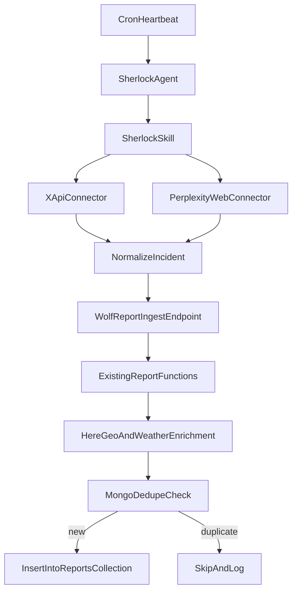

# Sherlock Agent Plan

## Goal

Create a new OpenClaw worker agent (`sherlock`) that runs on heartbeat/cron, discovers incidents via (1) official X API and (2) Perplexity web search/browser, then submits normalized incident payloads to a new additive Wolf ingest endpoint that uses existing report functions.

## Existing Contracts To Mirror

- Use Community Wolf report shape/enrichment behavior as the source contract from:
  - `[/Users/michaelhoughton/Documents/community-wolf/wolf-whatsapp-agents/lib/process-report-utils.ts](/Users/michaelhoughton/Documents/community-wolf/wolf-whatsapp-agents/lib/process-report-utils.ts)`
  - `[/Users/michaelhoughton/Documents/community-wolf/wolf-whatsapp-agents/lib/location-service.ts](/Users/michaelhoughton/Documents/community-wolf/wolf-whatsapp-agents/lib/location-service.ts)`
  - `[/Users/michaelhoughton/Documents/community-wolf/wolf-whatsapp-agents/lib/submit-report-utils.ts](/Users/michaelhoughton/Documents/community-wolf/wolf-whatsapp-agents/lib/submit-report-utils.ts)`

## Phase 1 (selected): OpenClaw runtime + additive Wolf ingest endpoint, pluggable connectors

## Non-Regression Constraint (Critical)

- Do not modify existing WhatsApp agent behavior, tool behavior, prompt behavior, or webhook route behavior.
- Changes in `wolf-whatsapp-agents` must be additive only: new endpoint + optional helper wrappers.
- Existing `submit_report` flow must remain unchanged for current users.

## Config And Agent Scaffolding

- Add agent definition in `[/Users/michaelhoughton/Documents/openclaw-experiment/openclaw-vps/.openclaw/openclaw.json](/Users/michaelhoughton/Documents/openclaw-experiment/openclaw-vps/.openclaw/openclaw.json)`:
  - New `agents.list` entry for `sherlock` with workspace `/root/.openclaw/workspace-sherlock`.
  - Add `sherlock` to `main.subagents.allowAgents`.
- Do not add per-agent web-search config for Sherlock; global web search is already configured in `openclaw.json` (`tools.web.search.provider=perplexity`).
- Register Mission Control assignee in `[/Users/michaelhoughton/Documents/openclaw-experiment/openclaw-vps/.openclaw/workspace/mission-control/agents.json](/Users/michaelhoughton/Documents/openclaw-experiment/openclaw-vps/.openclaw/workspace/mission-control/agents.json)`.
- Extend assignee enum in `[/Users/michaelhoughton/Documents/openclaw-experiment/openclaw-vps/.openclaw/workspace/mission-control/schema.task.json](/Users/michaelhoughton/Documents/openclaw-experiment/openclaw-vps/.openclaw/workspace/mission-control/schema.task.json)` to include `sherlock`.
- Add staggered cron heartbeat job in `[/Users/michaelhoughton/Documents/openclaw-experiment/openclaw-vps/.openclaw/cron/jobs.json](/Users/michaelhoughton/Documents/openclaw-experiment/openclaw-vps/.openclaw/cron/jobs.json)` for `agentId: sherlock`.
- Create workspace folder `workspace-sherlock` with baseline files (`AGENTS.md`, `SOUL.md`, `IDENTITY.md`, `HEARTBEAT.md`, `TOOLS.md`, `USER.md`, `memory/*`) modeled after existing specialist workspaces.

## Wolf WhatsApp Additive Integration

- Add a secured API route in `wolf-whatsapp-agents` for Sherlock ingestion.
- Route handler must call existing report submission/enrichment functions; no duplicate persistence logic in OpenClaw scripts.
- Add only minimal payload adapter logic for machine-source metadata and auth handling.
- Do not alter existing webhook routes or tool handlers.

## Skill + Executable Pipeline

- Create new skill at:
  - `/Users/michaelhoughton/Documents/openclaw-experiment/openclaw-vps/.openclaw/workspace-sherlock/.agents/skills/sherlock-incident-discovery/SKILL.md`
- Add executable scripts under the skill (or shared scripts path with skill wrappers), with one orchestrator command invoked from `HEARTBEAT.md`:
  - `collect-x-incidents.mjs` (official X API query + pagination + since-id state)
  - `collect-perplexity-incidents.mjs` (Perplexity-backed web/browser search, including x.com-focused queries)
  - `normalize-incident.mjs` (map source posts to canonical incident shape)
  - `submit-to-wolf-ingest.mjs` (secure POST to the new additive Wolf ingest endpoint)
  - `run-sherlock-cycle.mjs` (end-to-end driver used by heartbeat)
- Keep connector abstraction from day one so RSS/public API connectors can be added without redesign:
  - `connectors/base`
  - `connectors/x-api`
  - `connectors/perplexity-web`
  - future `connectors/rss`, `connectors/public-api`

## Source Strategy (MVP)

- Primary connector: official X API (structured, deterministic, cursor-friendly).
- Secondary connector: Perplexity web search/browser using existing OpenClaw global web tool config in `openclaw.json` (`tools.web.search.provider=perplexity`) with no extra per-agent tool wiring.
- Run both connectors in each cycle, then merge and deduplicate source candidates before posting to Wolf ingest.

## Report Payload Mapping Rules (Phase 1)

- Sherlock sends required incident fields expected by existing report functions (`coordinates`, `type`, `severity`, `keywords`, `summary`, optional `date/time`, and source evidence metadata).
- Wolf ingest endpoint owns final report shaping/enrichment/persistence by reusing existing functions.
- Maintain source traceability (source platform/post id/url and virality attributes) via additive metadata fields.

## Environment + State

- Extend `[/Users/michaelhoughton/Documents/openclaw-experiment/openclaw-vps/.openclaw/workspace/.env.example](/Users/michaelhoughton/Documents/openclaw-experiment/openclaw-vps/.openclaw/workspace/.env.example)` with Sherlock keys (names only, no secrets):
  - X API credentials
  - Wolf ingest endpoint URL
  - Wolf ingest endpoint auth token
- Keep cursor/state checkpoint (last processed post id/time window) in `workspace-sherlock/memory/heartbeat-state.json` for idempotent polling.
- Extend Wolf env examples with additive ingest auth settings only.

## Verification + Rollout

- Add a dry-run mode to the Sherlock cycle script (no DB writes, logs candidate incidents).
- Add a smoke test script under `[/Users/michaelhoughton/Documents/openclaw-experiment/openclaw-vps/.openclaw/workspace/scripts](/Users/michaelhoughton/Documents/openclaw-experiment/openclaw-vps/.openclaw/workspace/scripts)` for local sanity checks.
- Validate existing `submit_report` behavior remains unchanged (non-regression smoke check).
- Validate cron registration and one manual cycle execution before enabling full schedule.
- Deploy with VPS sync workflow from `[/Users/michaelhoughton/Documents/openclaw-experiment/.cursor/skills/openclaw-vps-sync/SKILL.md](/Users/michaelhoughton/Documents/openclaw-experiment/.cursor/skills/openclaw-vps-sync/SKILL.md)`.

## Phase 2 (deferred by your choice)

- Optional: extract a shared report-ingest package later if needed, while preserving current WhatsApp behavior.
- Keep Sherlock connectors and orchestration unchanged while swapping only adapter internals.

