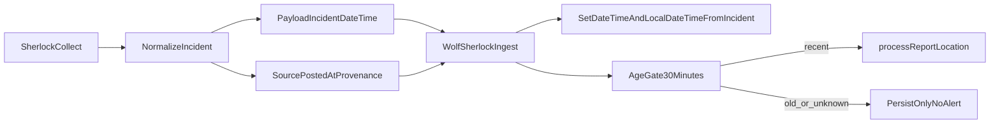

# Sherlock Incident Time + Alert Gating Plan

## Objective

Ensure Sherlock writes incident-occurrence time consistently and prevent stale incidents from being distributed as fresh alerts.

## What is wrong today

- Sherlock currently derives payload `date/time` from source `postedAt` in `[/Users/michaelhoughton/Documents/openclaw-experiment/openclaw-vps/.openclaw/workspace-sherlock/.agents/skills/sherlock-incident-discovery/scripts/normalize-incident.mjs](/Users/michaelhoughton/Documents/openclaw-experiment/openclaw-vps/.openclaw/workspace-sherlock/.agents/skills/sherlock-incident-discovery/scripts/normalize-incident.mjs)`.
- Wolf Sherlock ingest sets report `dateTime` to server processing time in `[/Users/michaelhoughton/Documents/community-wolf/wolf-whatsapp-agents/lib/process-report-utils.ts](/Users/michaelhoughton/Documents/community-wolf/wolf-whatsapp-agents/lib/process-report-utils.ts)`, while `localDateTime` is incident-like.
- Distribution age-check logic exists but is currently disabled/commented in the same file.

## Implementation approach

1. **Introduce explicit incident timestamp fields in Sherlock payload (OpenClaw side)**
  - Add `incidentDateTime` (and optional confidence flag) to normalized candidate output, separate from source posting timestamp.
  - Keep `source.postedAt` and `evidence.collectedAt` as provenance only.
  - Initial extraction policy: parse explicit date/time cues from candidate text when available; otherwise leave incident timestamp unresolved.
2. **Use incident timestamp as canonical event time in Wolf ingest (Wolf side)**
  - In `submitSherlockIncidentToExternalSystem(...)`, compute one canonical `incidentDateTime` from payload values.
  - Set report `localDateTime = incidentDateTime`.
  - Set report `dateTime = incidentDateTime` for Sherlock-ingested reports so UI sorting/header reflects occurrence time (not ingestion time).
  - Preserve ingestion/provenance via `createdAt` and `source_data.collected_at`.
3. **Re-enable/implement distribution gating for machine-ingest path**
  - Before calling `processReportLocation(...)`, calculate age from `incidentDateTime` in report location timezone.
  - If age > 30 min (or timestamp unresolved), still persist the report but skip distribution when `dispatchAlerts` is true.
  - Return response metadata indicating `distribution: skipped_age_gate` for observability.
4. **Update connector/normalizer contracts and docs**
  - Update Sherlock normalizer and connector contract docs in:
    - `[/Users/michaelhoughton/Documents/openclaw-experiment/openclaw-vps/.openclaw/workspace-sherlock/.agents/skills/sherlock-incident-discovery/SKILL.md](/Users/michaelhoughton/Documents/openclaw-experiment/openclaw-vps/.openclaw/workspace-sherlock/.agents/skills/sherlock-incident-discovery/SKILL.md)`
    - `[/Users/michaelhoughton/Documents/openclaw-experiment/openclaw-brain/SHERLOCK_AGENT_README.md](/Users/michaelhoughton/Documents/openclaw-experiment/openclaw-brain/SHERLOCK_AGENT_README.md)`
  - Document that source timestamps are provenance and incident time drives alerting.
5. **Validation**
  - Unit/integration checks for:
    - incident time parsed from text => report dates/times match occurrence
    - unresolved incident time => report saved, distribution skipped
    - old incident (>30 min) => report saved, distribution skipped
    - recent incident (<30 min) with `dispatchAlerts=true` => distribution executed

## Data flow target

## Key files to change

- OpenClaw:
  - `[/Users/michaelhoughton/Documents/openclaw-experiment/openclaw-vps/.openclaw/workspace-sherlock/.agents/skills/sherlock-incident-discovery/scripts/normalize-incident.mjs](/Users/michaelhoughton/Documents/openclaw-experiment/openclaw-vps/.openclaw/workspace-sherlock/.agents/skills/sherlock-incident-discovery/scripts/normalize-incident.mjs)`
  - `[/Users/michaelhoughton/Documents/openclaw-experiment/openclaw-vps/.openclaw/workspace-sherlock/.agents/skills/sherlock-incident-discovery/scripts/connectors/perplexity-web/index.mjs](/Users/michaelhoughton/Documents/openclaw-experiment/openclaw-vps/.openclaw/workspace-sherlock/.agents/skills/sherlock-incident-discovery/scripts/connectors/perplexity-web/index.mjs)`
- Wolf:
  - `[/Users/michaelhoughton/Documents/community-wolf/wolf-whatsapp-agents/lib/process-report-utils.ts](/Users/michaelhoughton/Documents/community-wolf/wolf-whatsapp-agents/lib/process-report-utils.ts)`
  - `[/Users/michaelhoughton/Documents/community-wolf/wolf-whatsapp-agents/app/api/internal/sherlock-ingest/route.ts](/Users/michaelhoughton/Documents/community-wolf/wolf-whatsapp-agents/app/api/internal/sherlock-ingest/route.ts)`

